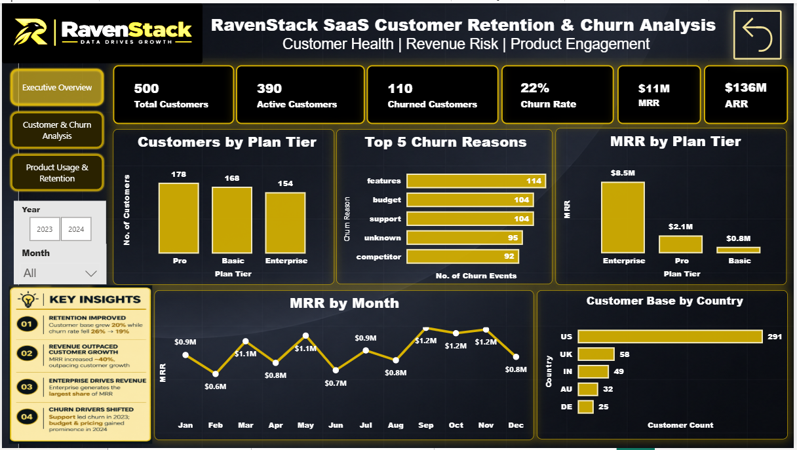
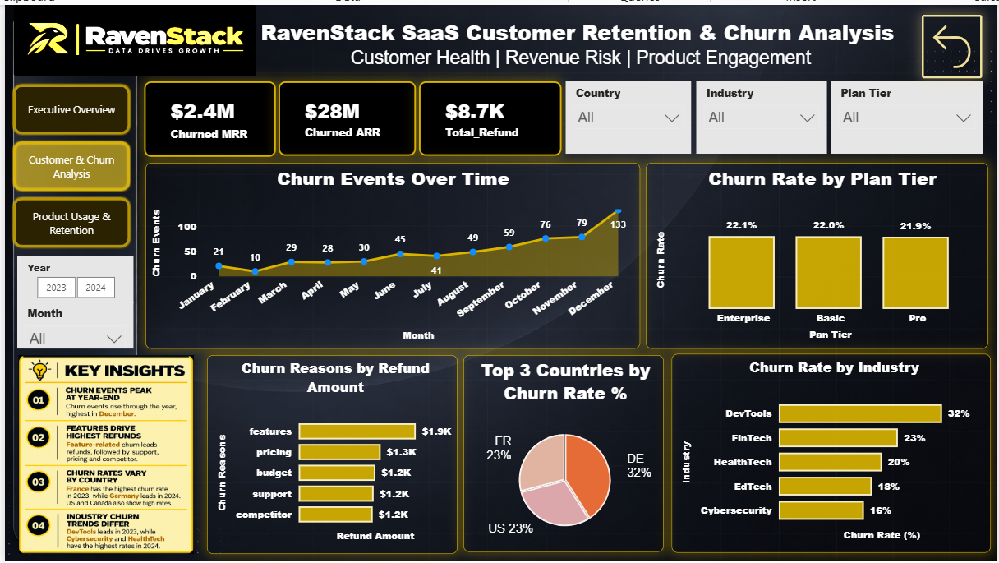
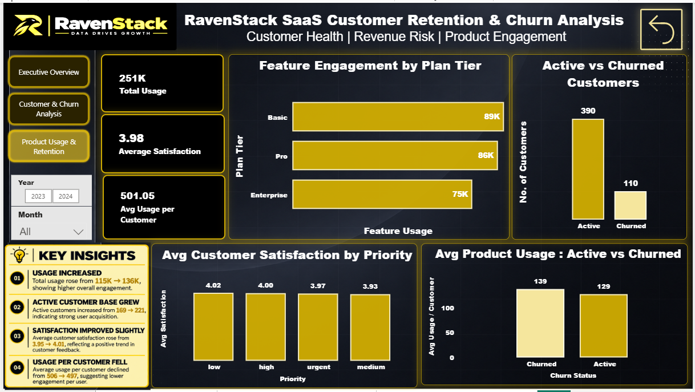

# RavenStack SaaS Customer Retention & Churn Analysis

> **Power BI | DAX | Power Query | Customer Analytics | Revenue Analytics**

An end-to-end Power BI analytics project focused on understanding **customer churn, retention, revenue risk, and product engagement** for RavenStack, a fictional SaaS business.

---

## 🎯 Objective

To transform customer, subscription, churn, support, and product-usage data into an interactive business intelligence dashboard that helps identify:

- Customer retention and churn trends
- Revenue at risk from churn
- Major churn drivers
- Customer and plan-level performance
- Product engagement and usage patterns
- Support and industry-level churn behavior

---

## 🖼️ Dashboard Preview

### Executive Overview

### 2. Customer & Churn Analysis

### 3. Product Usage & Retention

---

## 💡 Why I Built This Project

I built this project to demonstrate how **data analytics can translate raw business data into actionable insights**.

The goal was not just to create visualizations, but to answer practical business questions such as:

**Who is churning? Why are they churning? How much revenue is at risk? And how is product engagement changing over time?**

---

## 📊 Dashboard Overview

The dashboard is divided into three analytical views:

### 01 — Executive Overview
Provides a high-level view of:
- Customer base
- Churn rate
- MRR & ARR
- Plan-tier performance
- Churn reasons
- Geographic distribution

### 02 — Customer & Churn Analysis
Focuses on:
- Churn events over time
- Churned MRR & ARR
- Refund impact
- Support ticket priorities
- Country-level churn
- Industry churn rates

### 03 — Product Usage & Retention
Analyzes:
- Product usage
- Feature engagement
- Active vs. churned customers
- Customer satisfaction
- Usage per customer
- Usage vs. errors

---

## 🔍 Key Business Findings

### Customer & Revenue
- Customer base increased from **227 → 273**.
- Churn rate declined from **26% → 19%**.
- MRR increased from approximately **$5M → $7M**.
- **Enterprise** customers generate the largest share of MRR.

### Churn & Retention
- Churn activity shows a noticeable **year-end peak**.
- **Features** represent the highest refund-associated churn amount.
- Churn rates vary significantly across **countries and industries**.

### Product Engagement
- Total usage increased from **115K → 136K**.
- Active customers increased from **169 → 221**.
- Average satisfaction improved slightly from **3.95 → 4.01**.
- Average usage per customer declined from approximately **506 → 497**, despite overall usage growth.

---

## 🛠️ Tools & Technologies

- **Microsoft Power BI** — Dashboarding & Data Visualization
- **DAX** — Measures & KPI calculations
- **Power Query** — Data Cleaning & Transformation
- **Data Modeling** — Relationships & analytical structure
- **Excel / CSV** — Data Source & Preparation

---

## 📈 Key Metrics

The dashboard tracks:

**Customers | Active Customers | Churned Customers | Churn Rate | MRR | ARR | Churned MRR | Churned ARR | Product Usage | Satisfaction | Refunds**

---

## 🎨 Dashboard Features

- Interactive Year & Month filters
- Cross-filtering between visuals
- KPI cards
- Multi-page navigation
- Customer segmentation
- Revenue & churn analysis
- Product engagement analysis
- Business-focused data storytelling

---

